## Values, Types, and Variables

This lecture explores the fundamental building blocks of JavaScript: values, their types, and how we
store and manipulate them with variables. While our reading from _You Don't Know JS Yet: Get
Started_ (Chapter 2) provides deep conceptual background, this lecture connects those concepts
directly to practical coding and browser Document Object Model (DOM) manipulation.

### Key Lecture Topics

1. **Primitives vs. Objects**: Understanding JavaScript's 7 primitive types (`string`, `number`,
   `boolean`, `null`, `undefined`, `bigint`, `symbol`) and how they differ from objects and arrays.
2. **Strings & Template Literals**: Delimiting strings, expression interpolation using
   `${expression}` syntax, and essential methods (`slice`, `includes`, `split`, `trim`).
3. **Numbers and `NaN`**: Parsing numeric strings with `parseInt` and `parseFloat`, using the global
   `Math` object, and handling the unique behavior of `NaN` (and why `NaN !== NaN`).
4. **Type Inspection with `typeof`**: How to determine runtime types and understanding historical
   quirks like `typeof null === "object"` and `typeof [] === "object"`.
5. **Variable Declarations (`let`, `const`, `var`)**: Block scoping vs. function scoping, avoiding
   accidental globals, and the crucial difference between variable re-assignment and object/array
   mutation.
6. **Rendering Data to the Browser**: Using `document.querySelector` to locate HTML elements and
   dynamically populating their content and attributes with `.textContent` and `.innerHTML`.

### JavaScript Data Types Overview

```mermaid
flowchart TD
    JS["JavaScript Values & Data Types"]

    subgraph Primitives ["Primitive Types (Immutable • Passed by Value)"]
        P_Header["7 Built-in Primitives"]
        P1["string\n• Text data & template literals\n• Examples: 'hello', 'Ada'\n• typeof: 'string'"]
        P2["number\n• 64-bit float (IEEE 754)\n• Examples: 42, 3.14, NaN\n• typeof: 'number'"]
        P3["boolean\n• Logical truth values\n• Values: true, false\n• typeof: 'boolean'"]
        P4["undefined\n• Unassigned variable / missing property\n• Value: undefined\n• typeof: 'undefined'"]
        P5["null\n• Intentional absence of object value\n• Value: null\n• typeof: 'object' (historic quirk)"]
        P6["bigint\n• Arbitrary-precision integers\n• Example: 42n\n• typeof: 'bigint'"]
        P7["symbol\n• Unique and immutable identifier\n• Example: Symbol('id')\n• typeof: 'symbol'"]

        P_Header --> P1
        P_Header --> P2
        P_Header --> P3
        P_Header --> P4
        P_Header --> P5
        P_Header --> P6
        P_Header --> P7
    end

    subgraph Objects ["Object Types (Mutable • Passed by Reference)"]
        O_Header["Composite & Specialized Objects"]
        O1["Standard Object ({})\n• Key-value properties\n• Example: { name: 'Ada', score: 95 }\n• typeof: 'object'"]
        O2["Array ([])\n• Ordered numeric list (0-indexed)\n• Example: [1, 2, 3]\n• Check: Array.isArray()\n• typeof: 'object' (quirk)"]
        O3["Function\n• First-class callable object\n• Example: function() {}, () => {}\n• typeof: 'function'"]
        O4["Built-in & Host Objects\n• Built-ins: Date, RegExp, Map, Set\n• Browser DOM: HTMLElement, document\n• typeof: 'object'"]

        O_Header --> O1
        O_Header --> O2
        O_Header --> O3
        O_Header --> O4
    end

    JS --> P_Header
    JS --> O_Header
```

- **Primitives (7 Types)**: `string`, `number`, `boolean`, `undefined`, `null`, `bigint`, and
  `symbol`. Primitives represent single immutable values. Stored, passed, and compared by value.
- **Objects (Reference Types)**: Collections of key-value properties. Standard objects, arrays, and
  functions are all objects. Stored, passed, and compared by reference.
- **`typeof` Gotchas**:
  - `typeof null === "object"`: Uncorrected legacy bug from JavaScript's 1995 3-bit type tag system.
  - `typeof [] === "object"`: Arrays are specialized objects. Use `Array.isArray(value)` to test for
    an array.
  - `typeof NaN === "number"`: `NaN` ("Not a Number") represents an invalid numeric operation. Use
    `Number.isNaN(value)` to check.

### Resources & References

- Full Script: [Week 2 Lecture Script](../../lectures/week2-concepts.md)
- Textbook: _You Don't Know JS Yet: Get Started_, Chapter 2 (_Surveying JS_)
- Summary: [Week 2 Reading Summary](../../weekly-readings/week-02.md)
- CodeMash Talk: [Wat by Gary Bernhardt](https://www.destroyallsoftware.com/talks/wat)
- Quirks Reference: [wtfjs](https://github.com/denysdovhan/wtfjs)
